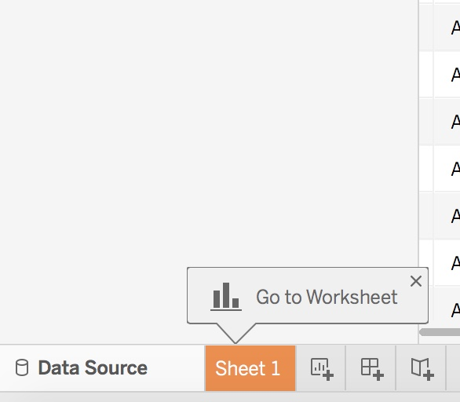
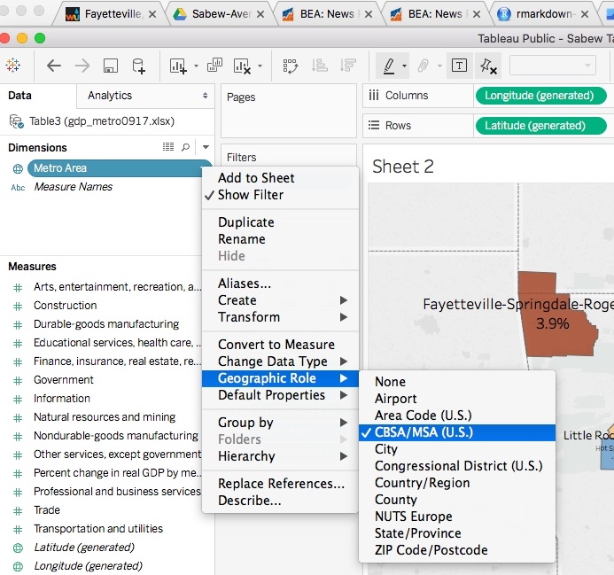

Visualizing the State & Local Economy
================

------------------------------------------------------------------------

 

------------------------------------------------------------------------

Presenters
==========

-   Rob Wells, Ph.D., University of Arkansas, Fayetteville, AR
-   Jeannine Aversa, Bureau of Economic Analysis, Washington, DC
-   Thomas Dail, Bureau of Economic Analysis, Washington, DC

------------------------------------------------------------------------

**This 1 hour hands-on session will show journalists how to retrieve and analyze regional GDP data and build basic maps with their findings.**

Learning Outcome: Journalists will learn to retrieve customized economic data for their own cities, counties or states and the steps to put it on a basic map and an interactive chart. We will use Google Sheets and Tableau Public.

 
----

Download Tableau Public
-----------------------

> <a href="https://public.tableau.com/en-us/s/" target="_blank">Tableau Download</a>

We'll configure this in the second part of the presentation, but you can start the download now. It is a 400 mb download that will take 1.46 GB on your hard drive.

Also, you will need to create a Tableau Public account.

 
----

Part 1: Storytelling with Local GDP Data
----------------------------------------

This section will analyze the storytelling possibilities with the Gross Domestic Product by Metropolitan Area data.

> <a href="https://www.bea.gov/newsreleases/regional/gdp_metro/gdp_metro_newsrelease.htm" target="_blank">GDP Release</a>

Describe the data set

> Gross domestic product (GDP) by metropolitan area is the sub-state counterpart of the Nation's gross domestic product (GDP), the Bureau's featured and most comprehensive measure of U.S. economic activity. GDP by metropolitan area is derived as the sum of the GDP originating in all the industries in the metropolitan area.

> Contributions to growth are an industry's contribution to the state's overall percent change in real GDP. The contributions are additive and can be summed to the state's overall percent change. The statistics of GDP by metropolitan area released today are consistent with statistics of GDP by state released May 11, 2017.

> GDP at chained volume measure is adjusted for the effect of inflation to give a measure of ‘real GDP’.

Data limitations

> This data series lags significantly. We are working with 2016 data, the most recent available, which was released September 20, 2017.

> But it is still the best you can get and you can't beat the price.

   
---

#### Step 1: Retrieve the Data

Click here to download the Excel tables

> <https://www.bea.gov/newsreleases/regional/gdp_metro/2017/xls/gdp_metro0917.xlsx>

-   Let's see what we have.
    -   Three tables of data.
    -   382 metropolitan areas.
    -   13 industrial sectors.

Walk through the tables:

**Table 1:** Basic GDP growth by metro, 2011-2016, and its rank nationally.
NYC is \#1, Sebring, Fla. is 382. Fayetteville, AR is 97.

**Table 2:** Inflation adjusted GDP, chained to 2009.
This is cool because it has the percentage change growth, 2015/2016, and ranks it. So Lake Charles, LA. makes the top of the list with 8.1 percent growth, **more than China in 2016**. Don't believe me? Look it up: <https://data.worldbank.org/country/china>

And Fayetteville makes \#38 on the list, with 3.9% growth.

 
----

> **Question: What is the benchmark metric?**

<!--Answer: US Metro areas is 1.7% growth. Is your region above or below that benchmark?-->
 
----

We will do the map exercise with Table 2 in a bit. But we have to look at Table 3.

**Table 3:** This is where we get the industry data.
Contributions to Percent Change in Real Gross Domestic Product (GDP) by Metropolitan Area, 2016)

Note the first column is the percentage change growth we saw in the Table 2. So that's a handy reference.

Data limitations - weirdness

> You may see a notation (D) in some cells. The footnote says: "(D) Not shown to avoid disclosure of confidential information, but the estimates for this item are included in the totals." What that means is this particularly industry is pretty small or has just a few dominant actors, so disclosure of the information would reveal confidential business information. Which is no fun whatsoever.

Data Cleaning
&gt; The Google sheet you have has been cleaned and modified so it will play well with Tableau. Basically, the BEA spreadsheet was cleaned to remove merged cells, a data dictionary was created to keep track of our changes and new headers were created. Here is a 10-minute video on how to do this yourself:

> <https://www.youtube.com/watch?v=5bS-GKvFzBk>

And here is the end result in a Google Sheet. Add this sheet to your Google Drive or download it as a spreadsheet on your computer.

> <https://docs.google.com/spreadsheets/d/18AgvFvHJruJUrU6LLbdI162Tjyfi4GdV0iBXgYg3IkY/edit#gid=910642061>

     
---

#### Step 2: Basic Interactive Chart

For this part, we will use Tableau Public to produce charts and a map. Download the app if you haven't already

> <https://public.tableau.com/en-us/s/>

You will need to create a Tableau Public account.

Launch the app.

Tableau accepts many data sources. Under "To a Server" there's an option for Google Sheets. Or if you have downloaded the cleaned spreadsheet to your computer, you can link to it via Excel.

> <https://docs.google.com/spreadsheets/d/18AgvFvHJruJUrU6LLbdI162Tjyfi4GdV0iBXgYg3IkY/edit#gid=910642061>

With the Google Sheets link, select Sheet 3 and drag it to the pane that says "Drag sheets here."

Clean the data with the "Data Interpreter." Click the box is right above the sheet listing.

**Now, look at the data.**

"Metro Area" should be the only thing in text: blue "ABC." That's a dimension. The rest should be with a green \# sign. Those are measures. The difference is crucial in Tableau. 

We're ready. Click on "Sheet 1" in lower lefthand corner.

Welcome to a Tableau Worksheet

1.  Drag the "Metro Area"" dimension to Columns
2.  Drag the "Percent Change in real GDP" measure to Rows

-   You should have an image like this:

-   This is your basic graph of GDP growth by metro area in from 2015 to 2016.
-   Let's sort it, high to low.

-   To do this, hover your mouse over the Y axis and a small arrow icon will emerge. Click it and it sorts your sheet.

-   Filter to Fayetteville and Little Rock

    -   To filter, click on the down arrow on blue pill in columns, "Metro Area." Click "Show Filter." A list of all 382 metro areas appears in a box on the sheet.

-   Configure the filter by clicking "Multiple Values Dropdown."

-   Deselect "All" so nothing is checked. Then select:

    -   Fayetteville
    -   Fort Smith
    -   Hot Springs
    -   Jonesboro
    -   Little Rock
    -   Pine Bluff
    -   U.S. metropolitan areas

> You now have a GDP growth chart for the metro areas in Arkansas with a U.S. comparison. You can do the same with your state later on.

-   Tweak the chart.

    -   Drag "Percent Change in real GDP" to Color in the Marks Column near the worksheet. You can select a custom color palette by clicking on colors.

    -   Double Click on the heading, "Sheet 1" and type in a headline. Use the formatting tools to center.

    -   Drag the Filter and Color legend to just above the X axis.

    -   Tweak the labels. Cntl + click on Y axis, format numbers to single decimal, add % as suffix. Next, click Labels in the Marks card, click box "Show Mark Labels." Numbers appear on the bars. Then cntl + click on a number, format to single decimal with a % as suffix.

-   Your chart should look like this:

> <https://public.tableau.com/views/SabewTable1/Sheet1?:embed=y&:display_count=yes&publish=yes>

     
---

#### Step 3: Basic Map

We'll use the same data for a map. First, we have to convert the Dimension "Metro Area" to geographic data, or we need to "Geocode" this dimension.

-   Geocode Data
    -   Click on "Metro Area" down arrow
    -   Select "Geographic Role" and then Select "CBSA/MSA"
        -   this converts the text of Metro Area into data for mapping.

Notice in Measures that Latitude and Longitude measures are now created.

**Follow These Steps In This Order:**

> -   Click on "new worksheet" tab at lower right. It creates Sheet 2.
> -   Drag Longtidue to Columns, Latitude to Rows
> -   In upper right "Show Me" menu, click on the map icon. A grayed out world map appears.
> -   Drag "Metro Area" to the sheet. A U.S. map appears with blue dots.

> -   Filter "Metro Area" blue pill in the Marks formatting box next to the sheet. Click "Show Filter" and format the filter as "multiple values dropdown" as we had in the past.
> -   Deselect "All" so nothing is checked. Then select:
> -   Fayetteville
> -   Fort Smith
> -   Hot Springs
> -   Jonesboro
> -   Little Rock
> -   Pine Bluff

> -   Change "Automatic" in Marks Card. Click down arrow and select "Map." The blue metro areas will appear on the map.
> -   Drag from Measures "Percent Change in real GDP" to the worksheet.
> -   Bring up the data labels. Drag "Percent Change in real GDP" to Label box on Marks card.
> -   Add Metro area names. Drag "Metro Area" to Label on Marks card. Click the Options box to allow labels to overlap
> -   Format labels, drag search box, legend to bottom, write a headline

 
----

**Your finished map should look like this:**

 
----

-   If you are good with this tutorial, then create a chart and map for your local community. Chart the rate of industry-specific sector growth by chooings one or more of the following:
    -   Arts, entertainment, recreation, accommodation, and food services
    -   Construction
    -   Durable-goods manufacturing
    -   Educational services, health care, and social assistance
    -   Finance, insurance, real estate, rental, and leasing
    -   Government
    -   Information
    -   Professional and business services
    -   Trade
    -   Transportation and utilities

Figure out some other visualization!

Thank you.

Follow up questions:
====================

-   Rob Wells - <rswells@uark.edu> or @rwells1961

-   Jeannine Aversa - <Jeannine.Aversa@bea.gov>

-   Thomas Dail - <Thomas.Dail@bea.gov>

--

 

--

--30--
